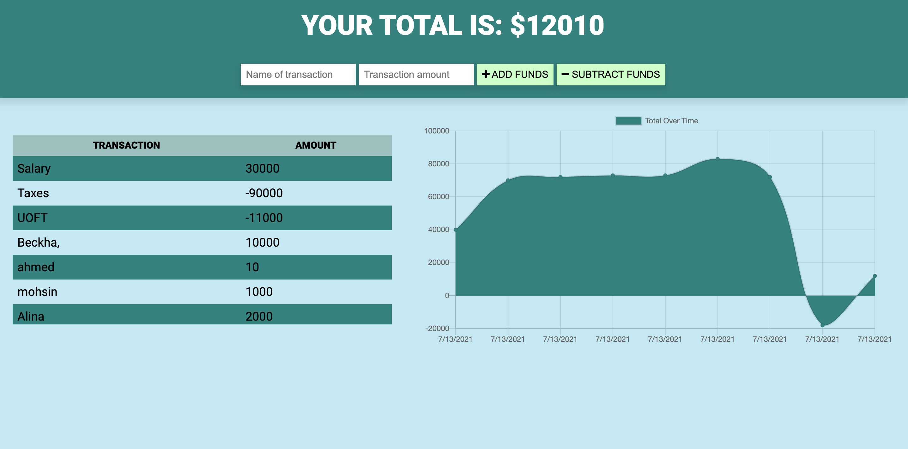
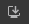

# Budget Tracker &nbsp;&nbsp;&nbsp;

## Description

A budget tracking app. Users can track their spending and savings, and see all their past transactions. Transactions are managed in a MongoDB database. The app is deplyed via Heroku with MongoDB Atlas. The app can be used in the browser or installed to the desktop or home screen as a PWA (Progressive Web Application). The app may be used online or offline.

The deployed app can be found [here](https://still-crag-28886.herokuapp.com/).

# Table of Contents
1. [Installation](#installation)
2. [Usage](#usage)
3. [Questions](#questions)
4. [License](#license)

## Installation
1. The app can be used in the browser [here](https://still-crag-28886.herokuapp.com/), or installed as a PWA.
2. To install the app as a PWA, navigate to the the [URL](https://still-crag-28886.herokuapp.com/).
3. On the right-hand side of the URL there will be a **+** or  button to install to the desktop/home screen.
4. On mobile, you may need to click page settings ( **⋮** ) to find the download button.
5. Click the icon on your homescreen or desktop to launch the app.

## Usage
Add expenses or savings via the form. Any transactions added while offline will be saved and submitted as soon as internet connection is reestablished.

## Questions
For additional questions, contact Danyal Khanzada:

GitHub: [DanyalKhanzada](https://github.com/DanyalKhanzada)

## Built Using
- JavaScript
- Node.js
- Express.js
- MongoDB with MongoDB Atlas
- Deployed via Heroku

## License
Under the MIT license, this material is free to modify and distribute for commercial or private use. See [here](https://opensource.org/licenses/MIT) for more details.

github testing